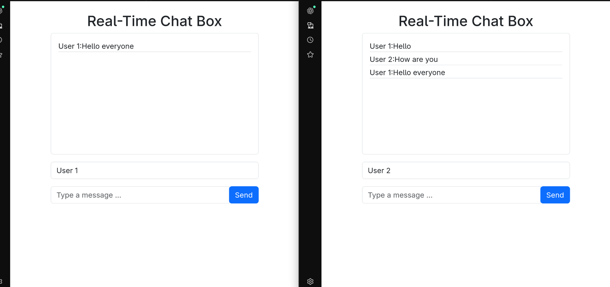

# Springboot-Real-Time-ChatBox

A real-time web application where users can chat and see updates instantly.  
Built with **Spring Boot**, **WebSockets (STOMP + SockJS)**, **Java**, and **HTML** for the frontend.  

---

## 🔹 Features

- Real-time chat updates using WebSockets  
- Simple and clean interface  
- Backend powered by Spring Boot  
- WebSocket communication handled with STOMP over SockJS  

---

## 🔹 Tech Stack

- **Backend:** Spring Boot, Java  
- **Frontend:** HTML, JavaScript (STOMP Client + SockJS)  
- **Real-Time Messaging:** WebSockets with STOMP protocol  

---

## 🔹 Setup & Run

1. Clone the repository  
   ```bash
   git clone https://github.com/your-username/Springboot-Real-Time-ChatBox.git
   cd Springboot-Real-Time-ChatBox
## Screenshot  

Here’s how it looks in action 👇  



